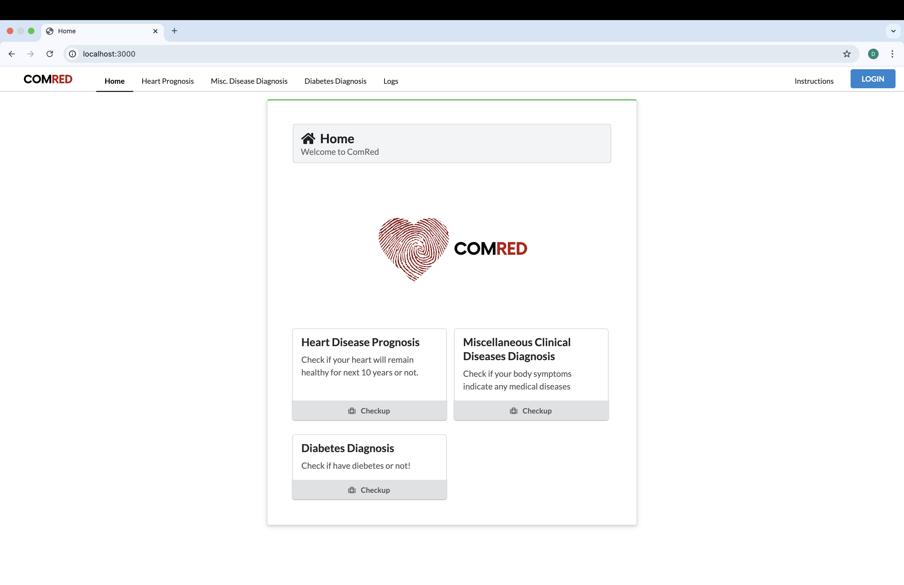
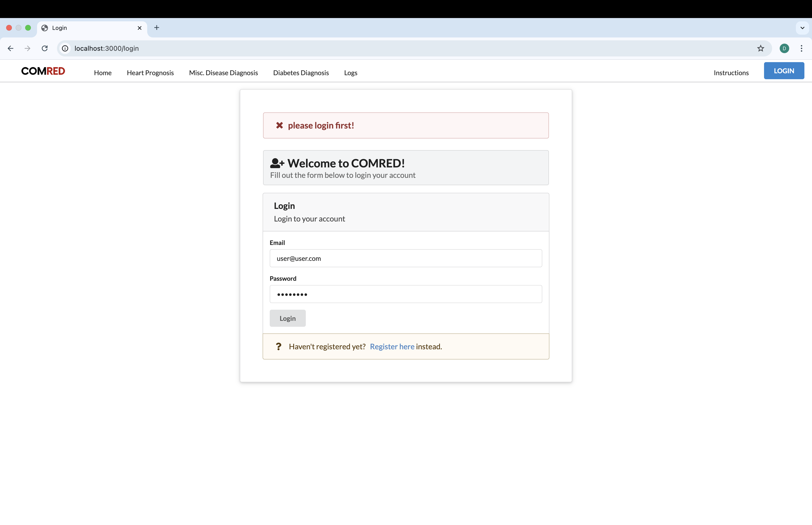
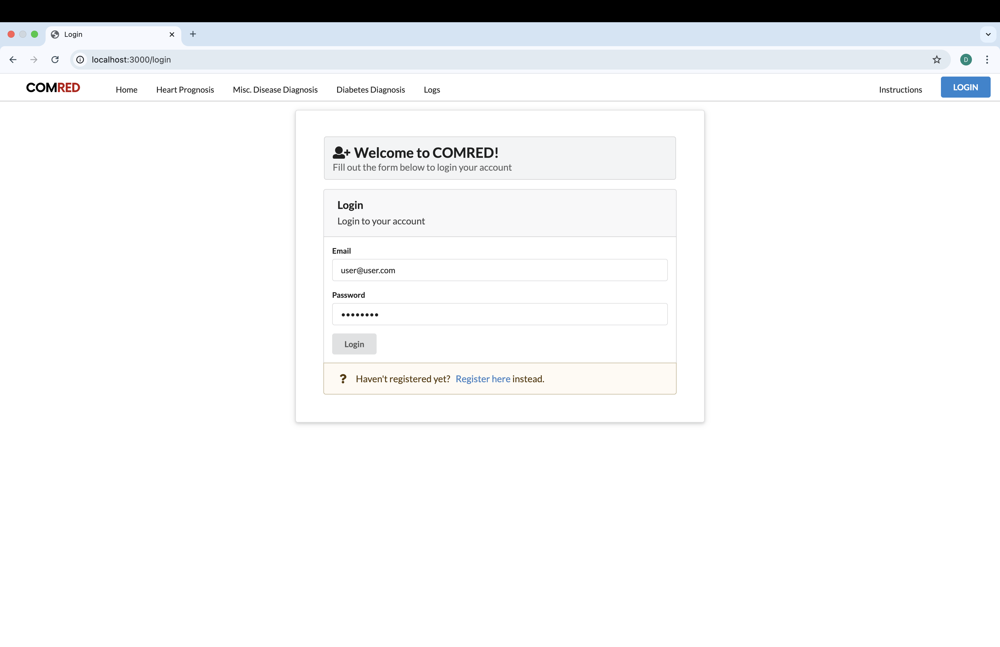
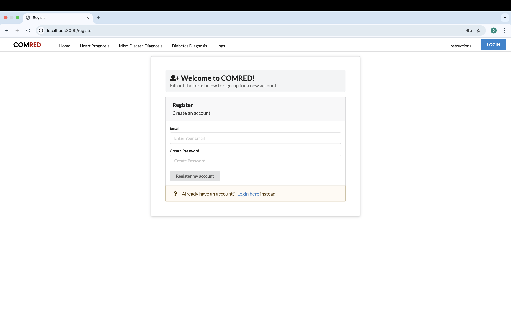
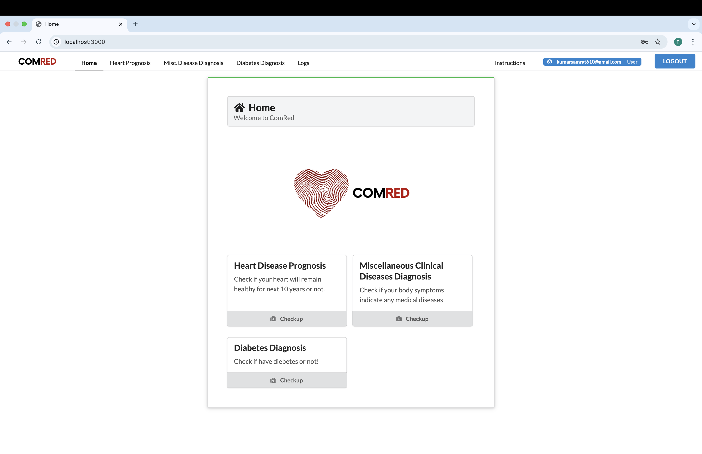
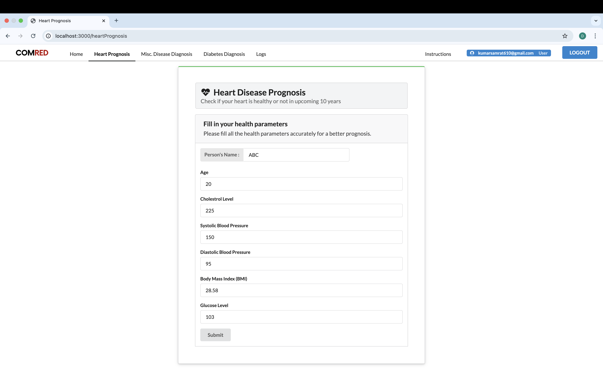
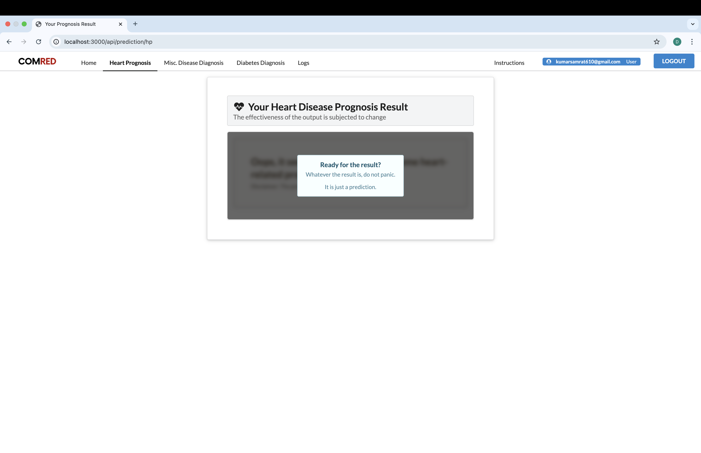
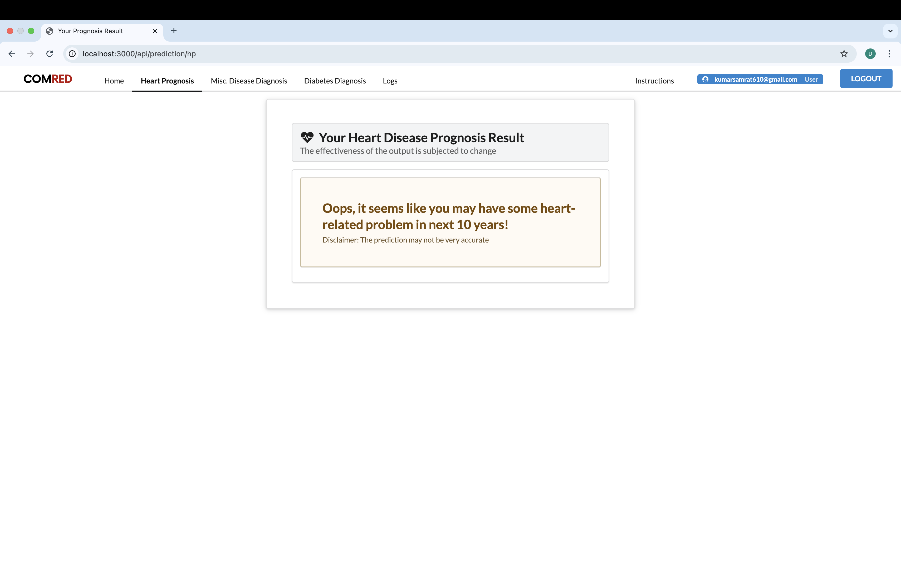

# COMRED - Health-care Decision Support System

COMRED is a web-based Clinical Decision Support System (CDSS) that helps users predict heart disease, diabetes, and miscellaneous diseases using machine learning models.

## Features

- User registration and login
- Heart disease prognosis prediction
- Diabetes diagnosis prediction
- Miscellaneous disease diagnosis
- User logs and history
- MongoDB Atlas integration
- Python ML backend (Flask)
- EJS templating and Express.js

## Screenshots

Below are screenshots of the COMRED application, showing the user interface and workflow:

1. **Home Page (Welcome to ComRed)**
   - Main dashboard with options for Heart Disease Prognosis, Miscellaneous Clinical Diseases Diagnosis, and Diabetes Diagnosis.
   
   

2. **Login Page (Prompted to Login)**
   - User is prompted to log in before accessing features.
   
   

3. **Login Page (Standard Login)**
   - User can enter email and password to log in.
   
   

4. **Register Page**
   - New users can register for an account.
   
   

5. **Home Page (Logged In)**
   - Dashboard view after successful login, showing user info and logout option.
   
   

6. **Heart Disease Prognosis Form**
   - User fills in health parameters for heart prognosis prediction.
   
   

7. **Heart Prognosis Result (Loading/Ready)**
   - Result loading screen with a message to prepare the user for the result.
   
   

8. **Heart Prognosis Result (Prediction)**
   - Final prediction result for heart disease prognosis.
   
   

---

> **Note:** Place your screenshots in a `screenshots/` folder in the project root and name them as shown above for the images to render correctly in GitHub.

## Setup Instructions

### Prerequisites

- Node.js (v14+ recommended)
- Python 3.10
- MongoDB Atlas account

### Installation

1. **Clone the repository:**
   ```sh
   git clone https://github.com/Divyanshu0230/Health-care.git
   cd Health-care
   ```

2. **Install Node.js dependencies:**
   ```sh
   npm install
   ```

3. **Set up Python environment:**
   ```sh
   python3.10 -m venv venv
   source venv/bin/activate
   pip install flask joblib numpy==1.21.6 scipy==1.7.3 scikit-learn==1.0.2
   ```

4. **Set up environment variables:**
   - Create a `.env` file in the root directory:
     ```
     DB_CONNECT=your_mongodb_connection_string
     ```

5. **Start the Flask server:**
   ```sh
   source venv/bin/activate
   python3 app.py
   ```

6. **Start the Node.js server (in a new terminal):**
   ```sh
   npm start
   ```

7. **Open your browser and go to:**
   ```
   http://localhost:3000
   ```

## Usage

- Register or log in.
- Use the prediction forms for heart, diabetes, or miscellaneous diseases.
- View your logs and history.

## Technologies Used

- Node.js, Express.js
- EJS templating
- MongoDB Atlas & Mongoose
- Passport.js authentication
- Python (Flask, scikit-learn, joblib)
- Bootstrap (UI)

## License

This project is for educational and demonstration purposes.

---

**If you use this code, please cite the original author.**
